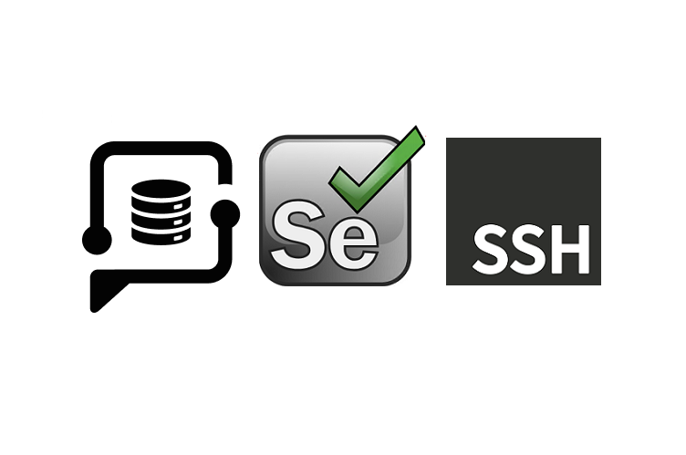

# PidginHost Selenium Testing Plugin with SSH tests

<p align="left" width="100%">

</p>

This repository includes tests for evaluating the functionality of [PidginHost Cloud](https://www.pidginhost.com/panel/cloud/), along with SSH tests.

## External requirements

```text
pytest
selenium
webdriver-manager
softest
openpyxl
ddt
pytest-html
bs4
paramiko
```

## Getting started

1. Create an SSH key pair and add the private key to the file [private_key.txt](ssh_tests/private_key.txt).

2. Add the public key to the file [public_key.txt](ssh_tests/public_key.txt).

3. Populate the test data in the Excel file [testdata.xlsx](testdata/testdata.xlsx).

> [!NOTE]
> Test outbound ports limited to Ubuntu packages only.

Test Data Format:
                                                
| user                     | user_password | cloud_package                            | operating_system |
|--------------------------|---------------|------------------------------------------|------------------|
| username@emaildomain.com | i7MnuS*o      | CloudV 0 (1 vCPU, 0.5 GB RAM, 20 GB SSD) | Ubuntu 22.04     |
| username@emaildomain.com | i7MnuS*o      | CloudV 1 (1 vCPU, 1 GB RAM, 32 GB SSD)   | Ubuntu 22.04     |


## Running Tests

Execute the following command to start the tests with the specified browser version:

```shell
pytest -v --browser firefox --url https://www.pidginhost.com/panel/account/login --html=report.html
```

Supported Browser Versions:
1. Edge
2. Chrome
3. Firefox

### Plugin executing the specified tests:

1. **Login Functionality**
   - Ensure the login process is efficient and properly handles authentication.

2. **Cloud Navigation**
   - Check the responsiveness of the Cloud navbar button click.

3. **Package Assertions**
   - Verify the package selected matches expectations.

4. **OS Selection**
   - Validate the functionality to select the operating system.

5. **Hostname Addition**
   - Implement a secure and efficient way to add the hostname.

6. **Public Key Handling**
   - Utilize secure methods for adding and handling public keys.

7. **Password Addition**
   - Implement secure password handling mechanisms.

8. **Network Interface Configuration**
   - Verify the public network interface enable process.

9. **IPv4 and IPv6 Configuration**
   - Ensure proper handling and validation of IPv4 and IPv6 addresses.

10. **Extra Volume Addition**
    - Efficiently handle the addition of extra volume.

11. **Cloud Creation Verification**
    - Confirm the cloud creation process is successful.

12. **Details Display**
    - Verify details button functionality and information displayed.

13. **Cloud IP Retrieval**
    - Implement a reliable method to retrieve the cloud IP.

14. **Cloud User Retrieval**
    - Ensure the cloud user information retrieval is accurate.

15. **SSH Connection Testing**
    - Efficiently test SSH connection functionality.

16. **Port Testing**
    - Verify outbound and inbound port configurations.

17. **Extra Volume Availability Check**
    - Ensure proper validation for the availability of extra volume.

18. **Server Destruction**
    - Implement a secure and efficient process to destroy servers when needed.

> [!NOTE]
> The plugin will generate an HTML report for all tests in [report.html](report.html) and an automation log in [automation.log](automation.log).